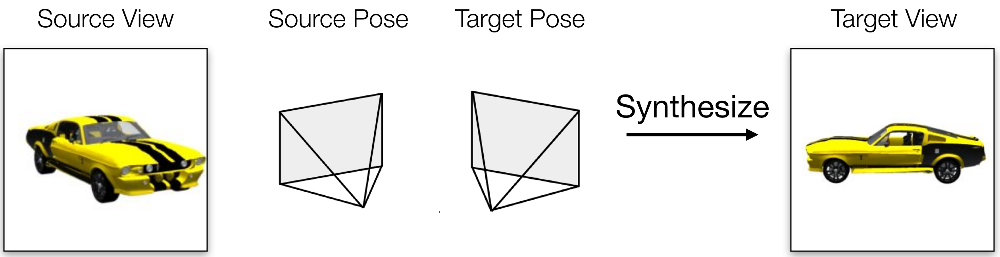
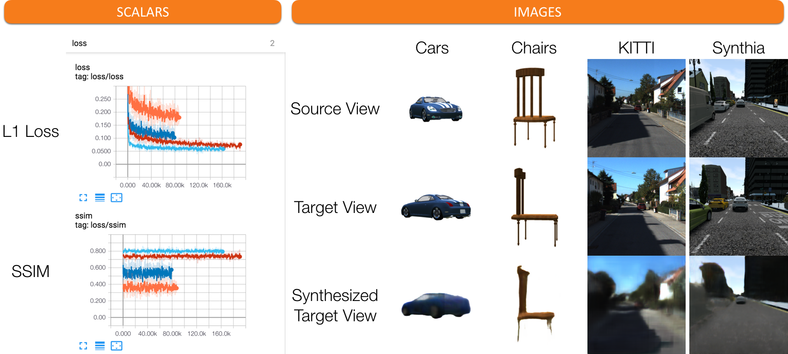
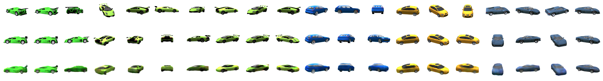

# Novel View Synthesis in TensorFlow

## Descriptions

This project is a TensorFlow implementation of **a simple novel view synthesis model**, which aims to synthesize a target view with an arbitrary camera pose from a given source view and its camera pose. An illustration of the task is as follows.

<p align="center">
    
</p>

The model implemented in the repo is a simple conv-deconv network with skip connections. To allow you to focus on building your own model and see how well it can work, all the data loaders/downloading scripts, the training code, as well as the training and testing splits  are well-configured based on the setting used in this paper: [**Multi-view to Novel view: Synthesizing Novel Views with Self-Learned Confidence**](https://github.com/shaohua0116/Multiview2Novelview) published in ECCV 2018. All you need to do is play with the model code: `synthesizer.py`.

The model can be trained on images rendered from 3D object models ([ShapeNet](https://www.shapenet.org/)) as well as real and synthesized scenes ([KITTI](http://www.cvlibs.net/datasets/kitti/) and [Synthia](http://synthia-dataset.net/)). All datasets are stored as HDF5 files, they will be downloaded once you run the training code. 

- ShapeNet: cars (150GB) and chairs (14GB)
<p align="center">
    
</p>

- KITTI (4.3GB)
<p align="center">
    
</p>

- Synthia (3.3GB)
<p align="center">
    
</p>

## Prerequisites

- Python 3.5
- [Tensorflow 1.12.0](https://github.com/tensorflow/tensorflow/tree/r1.0)
- [NumPy](http://www.numpy.org/)
- [colorlog](https://pypi.python.org/pypi/colorlog)
- [h5py](http://docs.h5py.org/en/latest/build.html#install)
- [imageio](https://pypi.org/project/imageio/)
- [six](https://pypi.org/project/six/)

## Usage
After downloading the datasets, we can start to train and test models using the following commands

### Train
Train a model from scratch
```bash
$ python trainer.py --batch_size 32 --dataset car
```

Fine-tune a model from a checkpoint
```bash
$ python trainer.py --batch_size 32 --dataset car --checkpoint /path/to/model/model-XXX
```

- Selected arguments (see the `trainer.py` for more details)
    - --prefix: a nickname for the training
    - --dataset: choose among `car`, `chair`, `kitti`, and `synthia`. You can also add your own datasets.
    - Checkpoints: specify the path to a pre-trained checkpoint
        - --checkpoint: load all the parameters including the flow and pixel modules and the discriminator.
    - Logging
        - --log\_setp: the frequency of outputing log info (`[train step  681] Loss: 0.51319 (1.896 sec/batch, 16.878 instances/sec)`)
        - --ckpt\_save\_step: the frequency of saving a checkpoint
        - --test\_sample\_step: the frequency of performing testing inference during training (default 100)
        - --write\_summary\_step: the frequency of writing TensorBoard summaries (default 100)
    - Hyperparameters
        - --batch\_size: the mini-batch size (default 8)
        - --max\_steps: the max training iterations

### Interpret TensorBoard
Launch Tensorboard and go to the specified port, you can see differernt losses in the **scalars** tab and plotted images in the **images** tab. The scalars include L1 loss and SSIM. The plotted images show (from top to bottom): source view, target view, and the predicted target view.

<p align="center">
    
</p>

### Test
Evaluate trained models
```bash
$ python evaler.py --dataset car --loss True --plot_image True --output_dir car_image --write_summary True --summary_file log_car.txt --train_dir train_dir/default-car-bs_16_lr_0.0001-num_input-1-20190430-014454 --data_id_list ./testing_tuple_lists/id_car_random_elevation.txt
```
- Selected arguments (see the `evaler.py` for more details)
    - Id list
        - --data_id_list: specify a list of data point that you want to evaluate
    - Task
        - --loss: report the loss
        - --write_summary: write the summary of this evaluation as a text file
        - --plot_image: render synthesized images
    - Output
        - --quiet: only display the final report
        - --summary_file: the path to the summary file
        - --output_dir: the output dir of plotted images

- Synthesized images
After plotting the synthesized images at the specified `output_dir`, we can see the results like this

<p align="center">
    
</p>

- Loss summary
The overall L1 loss and SSIM can be found at `log_car.txt`
```
Checkpoint: train_dir/default-car-bs_16_lr_0.0001-20190430-014454/model-160000
Dataset: car
Id list: ./testing_tuple_lists/id_car_elevation_0.txt
[Final Avg Report] Total datapoint: 10000 from ./testing_tuple_lists/id_car_elevation_0.txt
[Loss]
l1_loss: 0.13343
ssim: 0.90811
[Time] (63.128 sec)
```

## Related work

The code is mainly borrowed from this paper
- [Multi-view to Novel view: Synthesizing Novel Views with Self-Learned Confidence](https://github.com/shaohua0116/Multiview2Novelview) in ECCV 2018

Check out some other work in novel view synthesis

- [Multi-view 3D Models from Single Images with a Convolutional Network](https://arxiv.org/abs/1511.06702) in CVPR 2016
- [View Synthesis by Appearance Flow](https://arxiv.org/abs/1605.03557) in ECCV 2016
- [Transformation-Grounded Image Generation Network for Novel 3D View Synthesis](https://arxiv.org/abs/1703.02921) in CVPR 2017
- [Neural scene representation and rendering](http://science.sciencemag.org/content/360/6394/1204) in Science 2018
- [Weakly-supervised Disentangling with Recurrent Transformations for 3D View Synthesis](https://arxiv.org/abs/1601.00706) in NIPS 2015
- [DeepStereo: Learning to Predict New Views From the World's Imagery](https://arxiv.org/abs/1506.06825) in CVPR 2016
- [Learning-Based View Synthesis for Light Field Cameras](http://cseweb.ucsd.edu/~viscomp/projects/LF/papers/SIGASIA16/) in SIGGRAPH Asia 2016

## Cite the paper
If you find this useful, please cite
```
@inproceedings{sun2018multiview,
  title={Multi-view to Novel View: Synthesizing Novel Views with Self-Learned Confidence},
  author={Sun, Shao-Hua and Huh, Minyoung and Liao, Yuan-Hong and Zhang, Ning and Lim, Joseph J},
  booktitle={European Conference on Computer Vision},
  year={2018},
}
```

## Authors
[Shao-Hua Sun](http://shaohua0116.github.io/)
